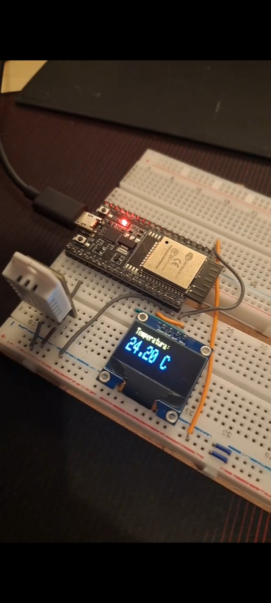
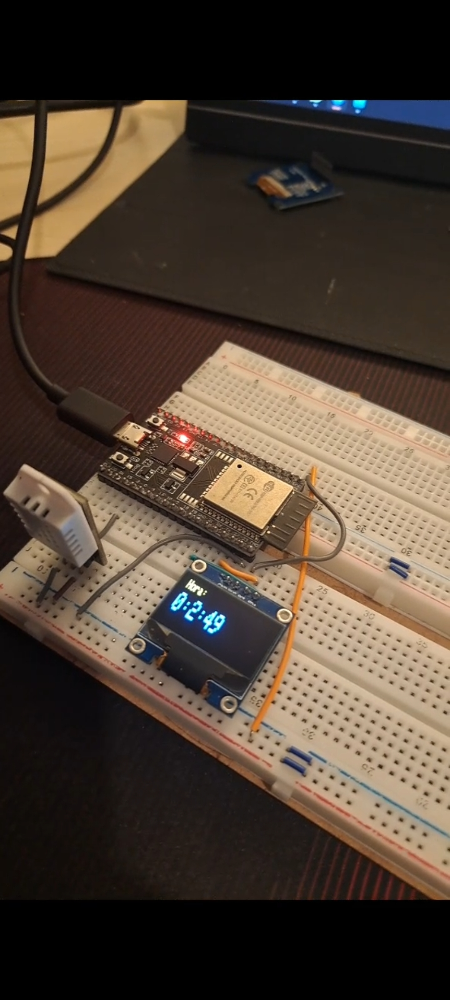

# ESP-32 Pomodoro Clock
  This is a pedagogical project aiming to utilize basic features of the microprocessor ESP32 to create a simple pomodoro methode clock that also displays the temperature using multiple ESP32 features, such as dual-core, internal RTC, I2C, and interrupts.

## Features:
- Uses the internal RTC to count time from 0.
- Takes temperature from the thermometer module DTH22.
- Displays it in the 128x32 OLED.
- Divides the task of displaying and the task of fetching values to each core (just to use parallel programming).
- Interrupt of user button in esp32 to change what is being displayed in the OLED or reset the pomodoro clock.

Temperature and pomodoro mode:

 
